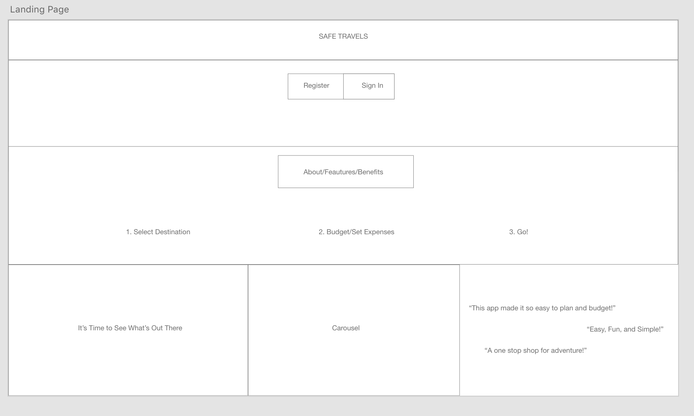
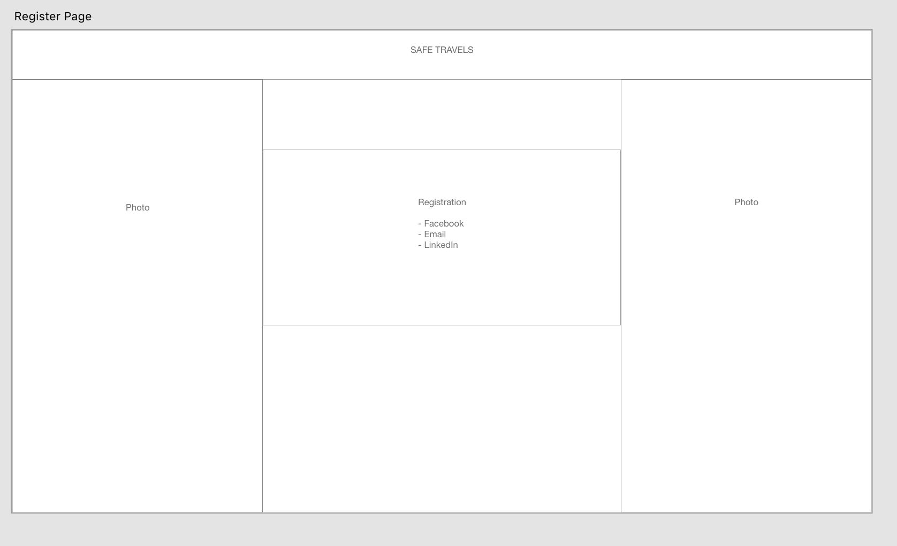

# Safe Travels 
### An application that helps you budget for your next trip.

## App value 
In a world where rent is higher than ever and gas prices are on a steady uptick, it can be hard to imagine going on a trip, much less a trip with extra funds to explore and take it all in. With Safe Travels you can see the average cost of travel to different countries across the globe and decide if the destination is right for you. You then, can create a budget/plan to save enough money to make you adventure dreams, a reality.

## Motivation
Cost of living is going up and it makes it harder to travel. Most of the time, people say “I can never afford anything like that”. With Safe travels, it can help even the tightest of budgets reach their goal. Traveling is good for the mind body and soul. Getting out of your comfort zone and seeing other ways of life and other cultures is important. Our goal is to help people unwind and find adventure to enrich their lives.

## Technologies 
1. Material.io
2. Auth-Lock
3. Express.js
4. React.js
5. MongoDB
6. Heroku
7. Bootstrap
8. Moment.js

## MVP
    Search bar feeature
    Bank - Control your budget 
    Save trips
    User Profile

# WIRE FRAME 

## Future Developments 
1. Implenment the upsplash API to show others vacation pitures 
2. The Bag. Helps you plan what to pack and acts like a checklist to make sure nothing gets left behind.
3. The ability to follow other users/ social media integration.
4. Multiple bags/budgets for multiple trips/destinations.

## Authors 
1. Van De Castro 
2. Ayn De Castro 
3. Mike Reza 
4. Lance Logan
